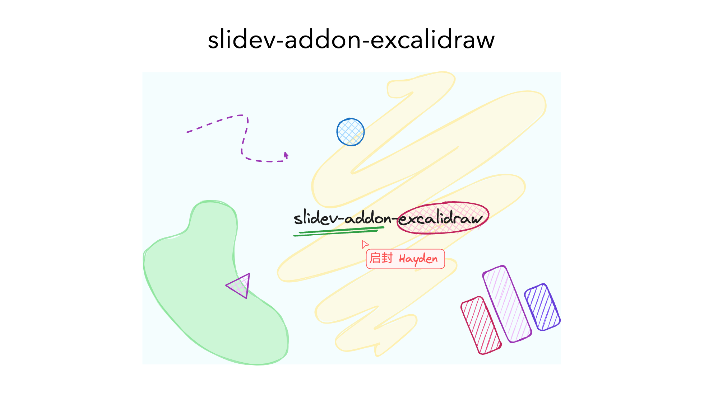

# slidev-addon-excalidraw

show excalidraw in [slidev](https://sli.dev/)



```md
---
layout: center
---
<div class="flex flex-col items-center">

# slidev-addon-excalidraw

<Excalidraw
  drawFilePath="/example.excalidraw.json"
  class="w-[600px]"
  :darkMode="false"
  :background="false"
/>

</div>
```

## Installation

```bash
pnpm add slidev-addon-excalidraw
```

### Usage

-   Define this addon in `frontmatter`

```yaml
addons:
    - slidev-addon-excalidraw
```

-   or in `package.json`

```json
 "slidev": {
    "addons": [
      "slidev-addon-excalidraw"
    ]
  },
```

## Components

### Excalidraw

```vue
<Excalidraw
  drawFilePath="/example.excalidraw.json"
  class="w-[600px]"
  :darkMode="false"
  :background="false"
/>
```

### Options

| Name | Type | Default | Description |
| --- | --- | --- | --- |
| `drawFilePath` | `string` | `undefined` | The path to the excalidraw json file. |
| `darkMode` | `boolean` | `false` | Whether to use dark mode. |
| `background` | `boolean` | `false` | Whether to show the background. |